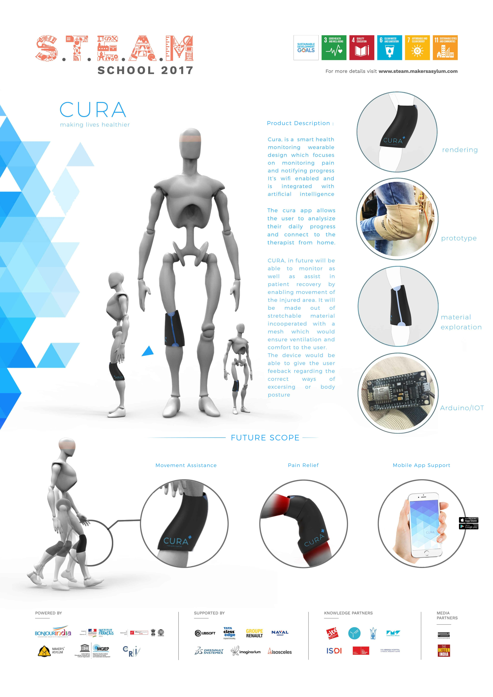

## CURA

* CURA is a smart health monitoring wearable device which focuses on monitoring pain and notifying the progress to the user. It is wifi enabled and integrated with AI. The CURA app allows user to track their daily progress and
connect to the therapist from home. 

* CURA, in future will be able to monitor as well as assist in patient recovery by enabling movement of the injured area. The device would be able to give the user feedback regarding the correct ways of excersing or body posture. 
--------

## Insight

  

    
  

 

---------

## Concept Ideation

  

    
  

 

  

    
  

 

  

    
  

 

  

    
  

 

  

    
  

 

  

    
  

 

  

    
  

 

  

    
  

 

--------

